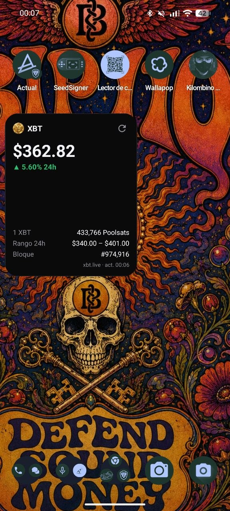
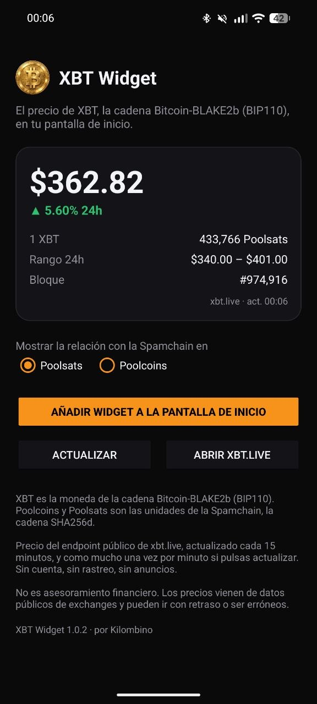
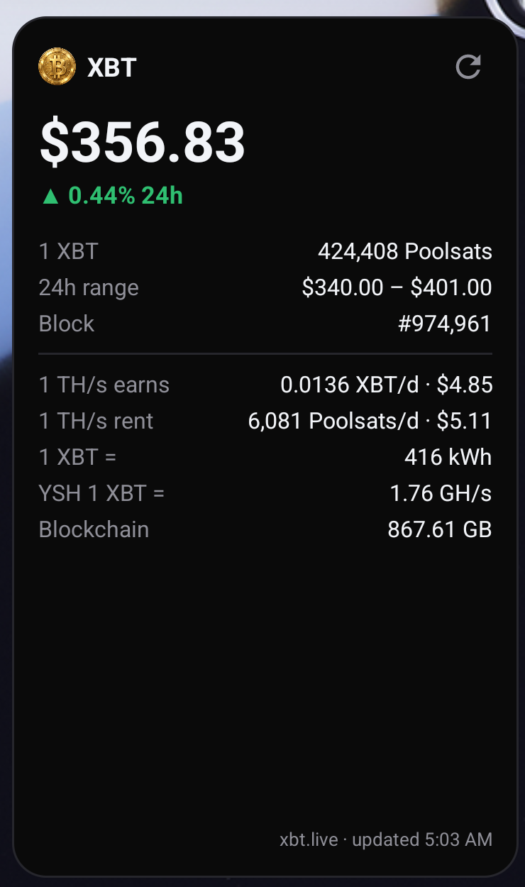

# XBT Widget

Android home screen widget with the live price of **XBT**, the coin of the Bitcoin-BLAKE2b chain (BIP110).

<p>



</p>

- XBT price in USD and 24h change
- Ratio to the Spamchain (the SHA256d chain), in **Poolsats** or **Poolcoins**
- 24h range, block height and time of the last update
- Large size: what 1 TH/s earns, the cheapest rent of 1 TH/s, kWh per XBT, YSH and blockchain size, from [mempool.kilombino.com](https://mempool.kilombino.com)
- Resizable: a compact layout is used when the widget is small
- Background refresh every 15 minutes; refresh button limited to once a minute
- No account, no tracking, no ads. English and Spanish.

## Install

From [Zapstore](https://zapstore.dev) (search "XBT Widget"), or download the APK from [Releases](https://github.com/Kilombino/xbt-widget/releases).

Then long-press the home screen → Widgets → XBT Widget, or open the app and tap **Add widget to home screen**.

## Data

Prices come from the public endpoint [`xbt.live/api/widget`](https://xbt.live/widget/), which its author offers for third-party widgets. The app polls it at most once a minute, as requested. This app is not affiliated with xbt.live.

Mining and network data come from [`mempool.kilombino.com/api/v1/blake2b/widget`](https://mempool.kilombino.com/api/v1/blake2b/widget), which computes the same figures as the header of mempool.kilombino.com. It only uses public sources (the node, Neoxa, MiningRigRentals and Kraken), so there is nothing secret in this app. The server caches the answer for a minute and can tell the app to poll less often; the app polls at most every 15 minutes, at a random minute, and backs off when the server doesn't answer.

Not financial advice: prices come from public exchange data and can be delayed or wrong.

## Build

```sh
export ANDROID_HOME=$HOME/Android/Sdk
echo "sdk.dir=$ANDROID_HOME" > local.properties
./gradlew assembleRelease     # JDK 17
```

Without a `keystore.properties` file the release build is signed with the debug key.

## License

MIT
