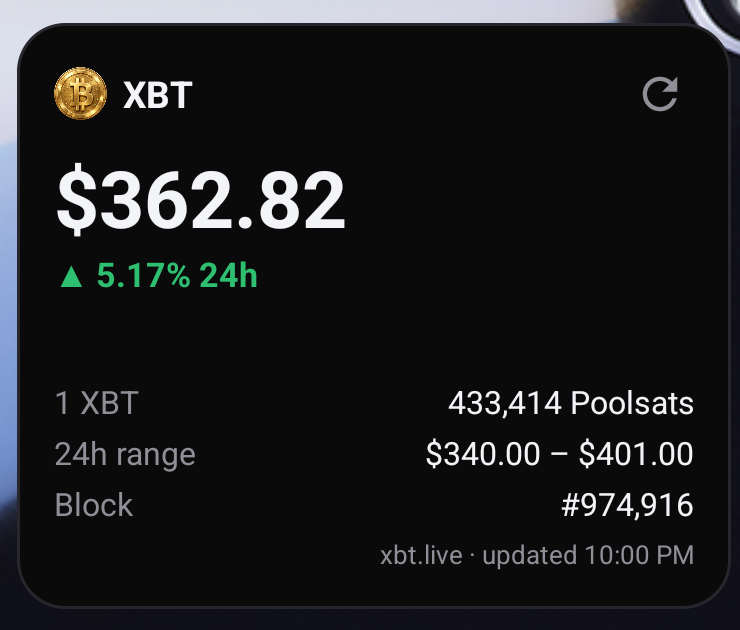
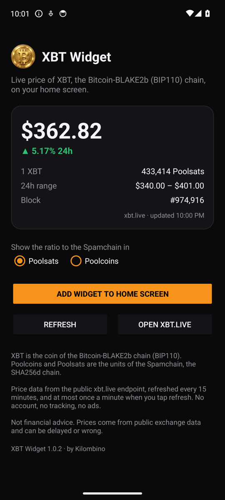

# XBT Widget

Android home screen widget with the live price of **XBT**, the coin of the Bitcoin-BLAKE2b chain (BIP110).

<p>


</p>

- XBT price in USD and 24h change
- Ratio to the Spamchain (the SHA256d chain), in **Poolsats** or **Poolcoins**
- 24h range, block height and time of the last update
- Resizable: a compact layout is used when the widget is small
- Background refresh every 15 minutes; refresh button limited to once a minute
- No account, no tracking, no ads. English and Spanish.

## Install

From [Zapstore](https://zapstore.dev) (search "XBT Widget"), or download the APK from [Releases](https://github.com/Kilombino/xbt-widget/releases).

Then long-press the home screen → Widgets → XBT Widget, or open the app and tap **Add widget to home screen**.

## Data

Prices come from the public endpoint [`xbt.live/api/widget`](https://xbt.live/widget/), which its author offers for third-party widgets. The app polls it at most once a minute, as requested. This app is not affiliated with xbt.live.

Not financial advice: prices come from public exchange data and can be delayed or wrong.

## Build

```sh
export ANDROID_HOME=$HOME/Android/Sdk
echo "sdk.dir=$ANDROID_HOME" > local.properties
./gradlew assembleRelease     # JDK 17
```

Without a `keystore.properties` file the release build is signed with the debug key.

## License

MIT
